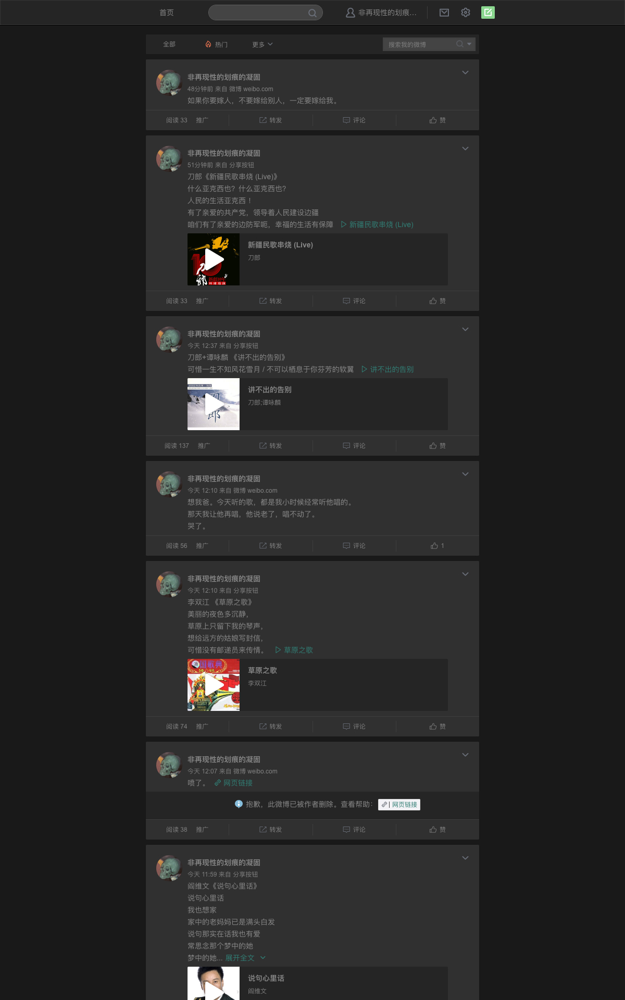
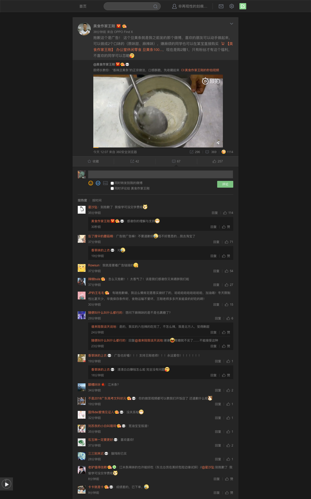
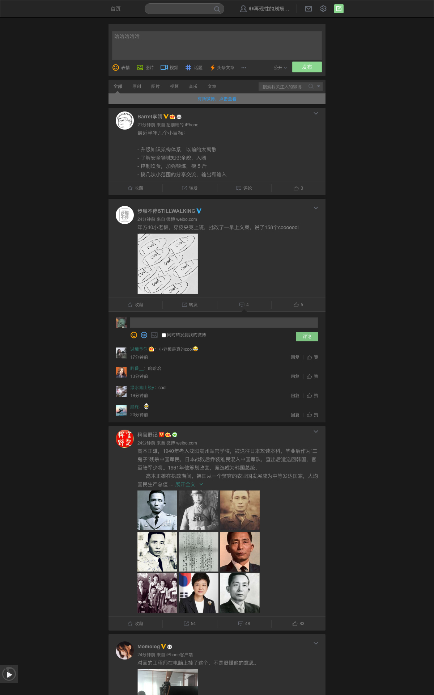

<!-- fuck jekll page title -->
<!-- # Bedarkmode -->

    

<h3>
    微博预览效果
    <a class="fuck-btn" target="_blank" href="./download/weibo-dark-mode.user.js">安装微博脚本 v0.0.3</a>
</h3>

<ul class="screenshot-list">
    <li>
        
个人页

        
    </li>

    <li>
        
单条微博详情页

        
    </li>

    <li>
        
微博首页

        
    </li>
</ul>

