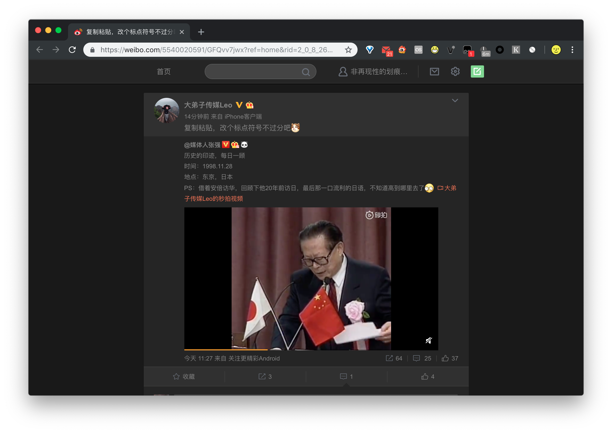

<!-- fuck jekll page title -->
<!-- # Bedarkmode -->

<h3 style="text-align: center;">
    微博
    <a class="fuck-btn" target="_blank" href="./download/weibo-dark-mode.user.js">下载</a>
</h3>

<ul class="screenshot-list">
    <li>
        
个人页

        
    </li>

    <li>
        
单条微博详情页

        
    </li>

    <li>
        
微博首页

        
    </li>
</ul>

